[**中文**](#Vue3SpringBoot3搭建以我的世界为主的资源分享论坛) | [**English**](#Building-a-resource-sharing-forum-centered-around-Minecraft-using-Vue3-and-SpringBoot3)

---

---

# Project connection 项目连接

---

**gitee:** [StarFall-Vue3](https://gitee.com/turing-ice/StarFall-vue) | [StarFall-SpringBoot3](https://gitee.com/turing-ice/StarFall-SpringBoot)

**github:** [StarFall-Vue3](https://github.com/Turing158/StarFall-vue) | [StarFall-SpringBoot3](https://github.com/Turing158/StarFall-SpringBoot)

---

---

# Building a resource-sharing forum centered around Minecraft using Vue3 and SpringBoot3

---

> Need to be used with **StarFall-vue**：[gitee](https://gitee.com/turing-ice/StarFall-vue)，[github](https://github.com/Turing158/StarFall-vue)

*tips: Remember to start the Redis service after starting Springboot, otherwise an error will be reported!* 

## Have something to say

---

This forum sounds interesting! Such a resource sharing platform has infinite possibilities for the community to build and spread the Minecraft game and let more people know about the world of this block. This project is open source, a game forum created by **Vue3**+**SpringBoot3**, which can share communication and chat with players. The responsiveness and performance advantages of **Vue3**, coupled with the stability and strong back-end support of **SpringBoot**, will provide users with smooth experience and reliable service. In the forum, everything from beginner tutorials to art creation, from Redstone techniques to module research, is likely to become a topic of discussion, so that players can share their own insights and experiences, get inspired and help.

## Project composition

---

###  web Front-end

---

The front-end page created by **Vue3**+**ElementPlus** is composed of user operation, management panel, login registration and other pages. **pinia** is used for local sustained storage. Most of the pages operated by users are composed of components written by themselves, and a small amount is operated by **ElementPlus**. The management panel is composed of **ElementPlus**, which can replace the black and white theme and visually edit the database information, so that administrators can easily manage every move of the forum.

### 后端

---

With **SpringBoot**+**SpringSecurity**+**Mybatis**+**Redis**+**JJWT**, it provides the ability to quickly start projects, automatic configuration and the principle of convention over configuration can reduce the workload of developers, and also provide a secure and reliable way to protect your applications on the back end. The combination of these can improve the safety, development efficiency and performance of the project, and provide a good foundation for the successful implementation of the project.

#### SpringBoot

The entire project is built with the **SpringBoot** framework, which provides the ability to quickly start a project, easily modify changes to the current environment through automatic configuration and convention over configuration principles, as well as a little configuration of resources\application.properties. Developers can quickly set up a running Spring application; Through the support of **SpringBoot** framework, it also makes writing code more simple and fast; **SpringBoot** integrates a number of commonly used frameworks and libraries, which can quickly integrate these components and reduce the workload of developers. **SpringBoot** was designed with the needs of production environments in mind and provides rich production-level features such as security, performance optimization, fault tolerance, etc., to ensure the stability and reliability of applications in production environments.

#### SpringSecurity

As a member of the Spring family bucket, it can perfectly adapt to the **SpringBoot** project and provide perfect session management functions, which can realize single sign-on, session timeout control, concurrency control, etc., and can carry out security management of the project. **SpringSecurity** is designed with performance in mind. It ensures the efficient operation of the security mechanism through various optimization methods, such as caching and asynchronous processing. The project carried out the API security management and permission verification through **SpringSecurity**, which can make the API access and not disclose the database information without reason, and ensure the data security.

#### Mybatis

**Mybatis** provides an easier way to access databases, reducing the effort of writing JDBC code. Developers only need to write SQL statements and mapping rules to automatically implement database operations; **SpringBoot** has good support for **Mybatis**, and can quickly integrate **Mybatis** with simple configuration, which greatly improves the development efficiency. **SpringBoot** combined with **Mybatis** can simplify the development of the persistence layer and provide a convenient database operation interface. Can make the back-end access to the database more speed and convenient; **Mybatis** supports dynamic SQL and can generate SQL statements dynamically according to conditions, which greatly improves the reusability and maintainability of SQL statements. Moreover, the built-in first-level cache and second-level cache mechanism can effectively reduce the number of database queries and improve the performance of applications.

#### Redis

**Redis** is a memory-based database with very fast read and write speed, which is suitable for use as a high-performance cache system. **SpringBoot** is adapted to **Redis** at the back end to cache users' and frequently used data, thus speeding up API access speed and enabling the front end to receive responses from the back end faster. And ease the backend and database access pressure; Supports multiple persistence modes, including snapshot and log addition, to ensure persistent data storage and prevent data loss. In Spring Boot projects, you can use **Redis** to manage session status, realize distributed session sharing, and improve the scalability and reliability of the system. **SpringBoot** provides good support for **Redis**, and **Redis** can be quickly integrated through simple configuration, which greatly improves development efficiency.

#### JJWT

**JJWT** provides a simple and easy to use API, developers can quickly get started, easily implement JWT generation, signature, verification and parsing operations; Integrating Spring Security to simplify JWT-based authentication and authorization; Use **JJWT** to translate your information into tokens, so that you can have temporary and unique identifiers. You can set the expiration date of your tokens to prevent data leaks by simply logging in somewhere else. In this way, users do not need to log in repeatedly, and the token is mindlessly refreshed.

## Feature

---

### Home

The layout is top, middle, and bottom. The top is a wheel chart and bulletin, the middle is a navigation bar, and the bottom is a content display

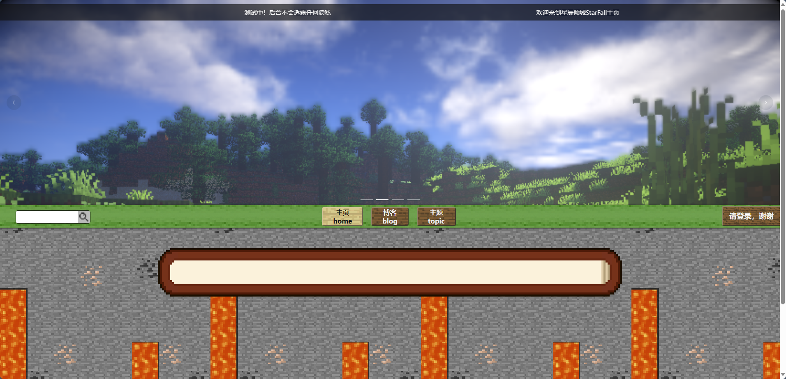

### Login \ Register \ Forgot password

Operations involving private data require dynamic image verification codes to prevent brute force cracking of user information

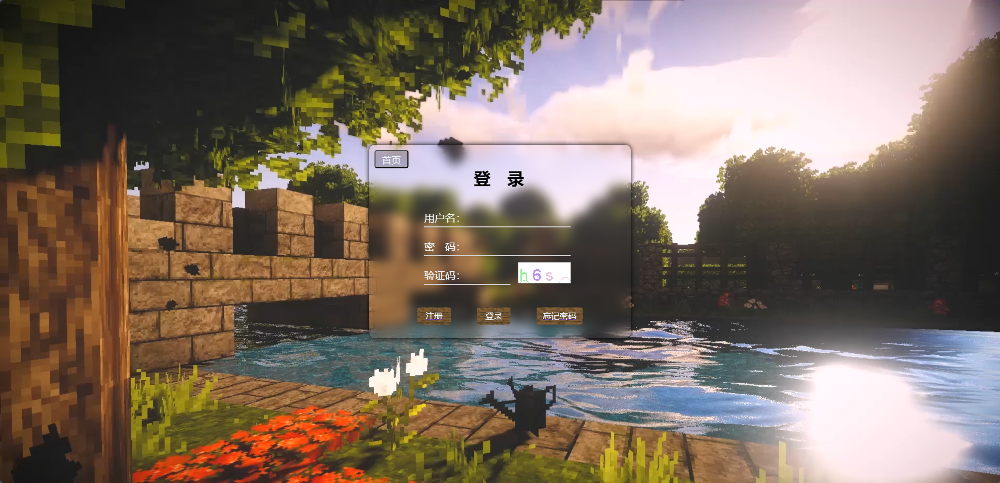

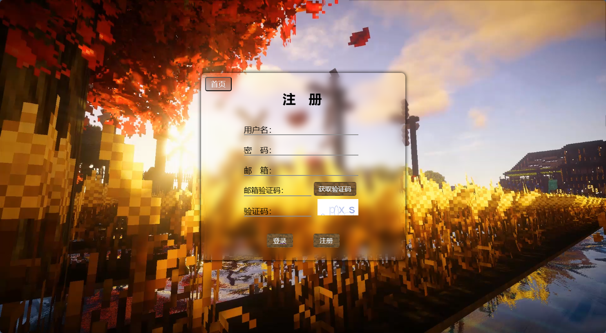

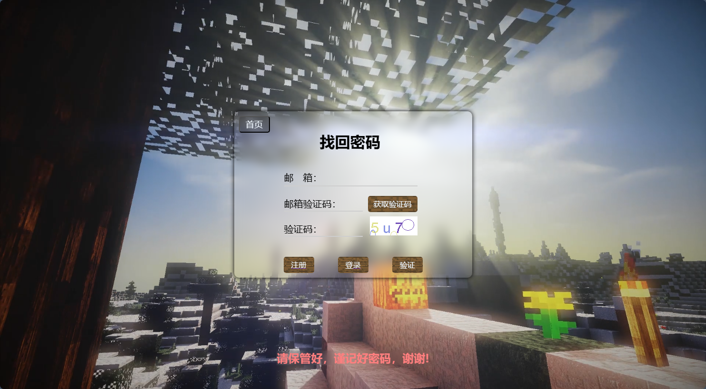

### Topic

Theme page is not logged in users can also access, in order to let users browse first, interested in resources will go to register login

Click on the topic's title to take you to the details page

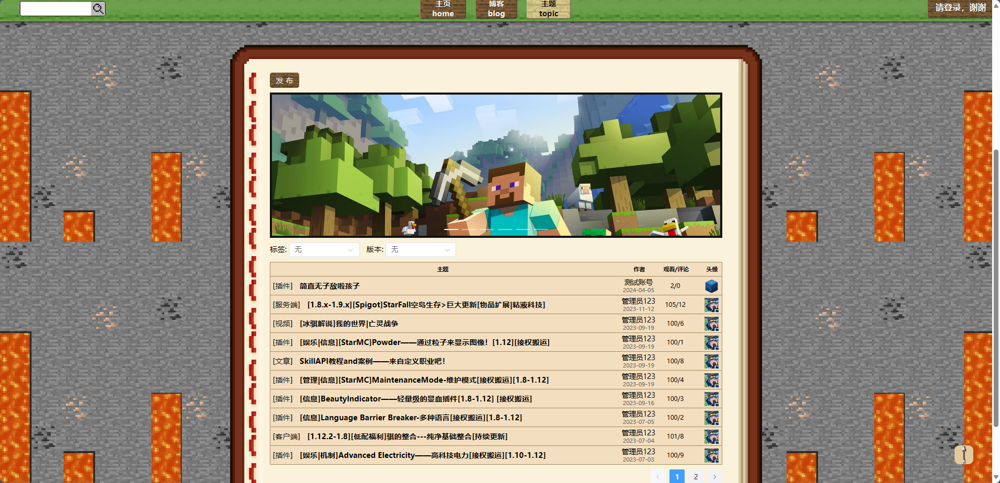

### Topic detail page

Click the avatar in the right column to jump to the user's detailed page, and you can like and step on it after logging in under the title

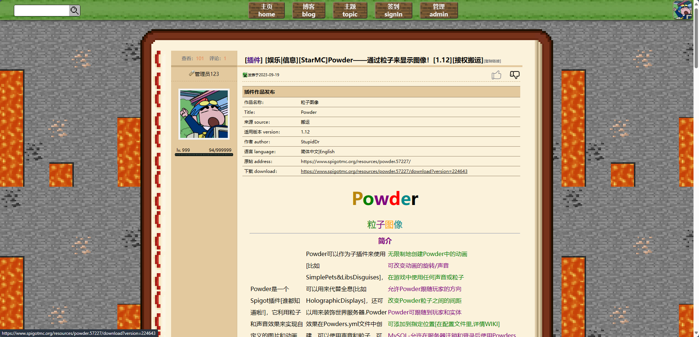

### Topic comment

Users can comment on topics after logging in

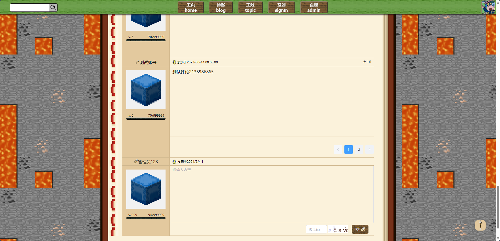

### After login page

The navigation bar has more check-in options. If you are an administrator, more management options will appear

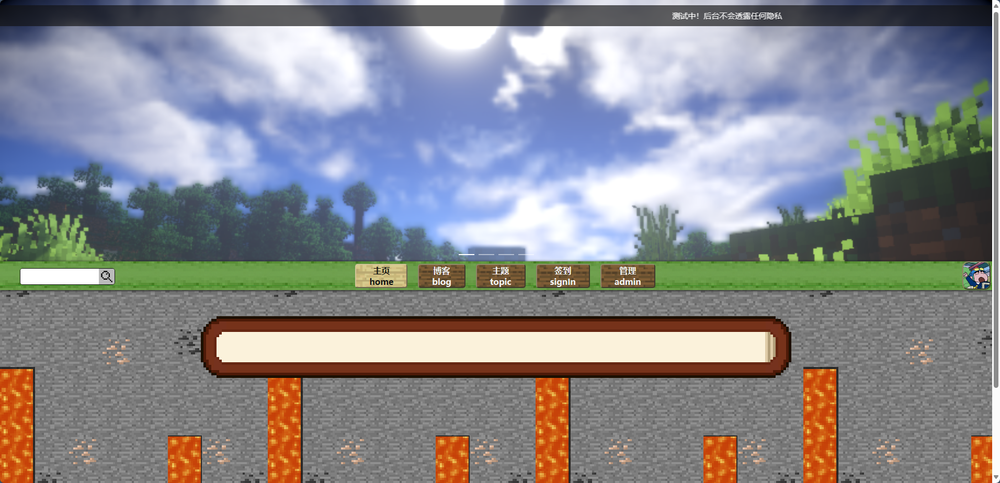

### Personal homepage

You can see your personal information, as well as published topics, and published topics can be edited and deleted

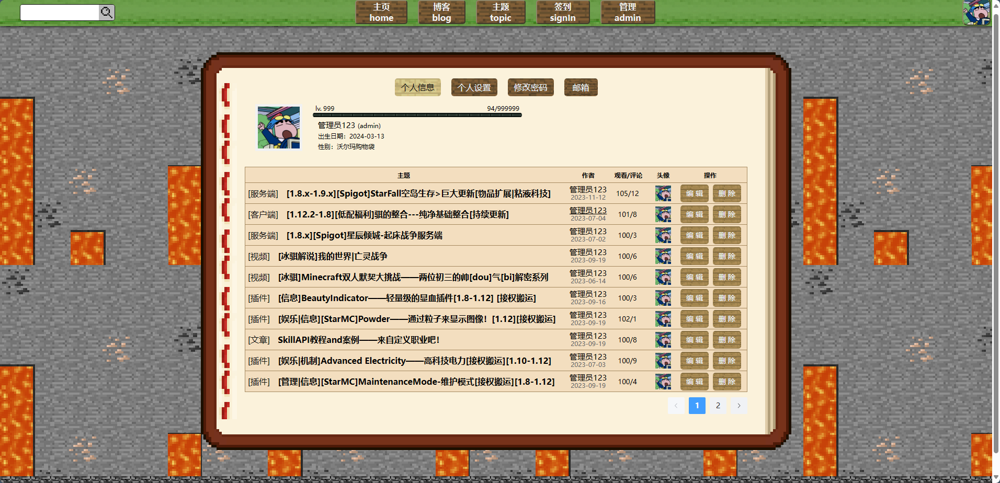

### Personal Settings

#### Modify personal information

You can make changes to your personal information, including your avatar

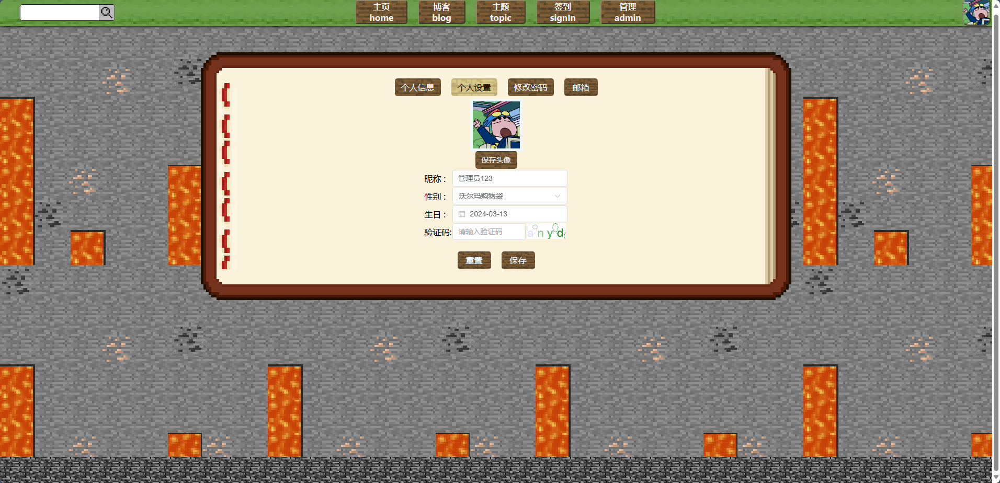

#### Modify profile avatar

Avatar changes can be clipped and uploaded with VueCropper support

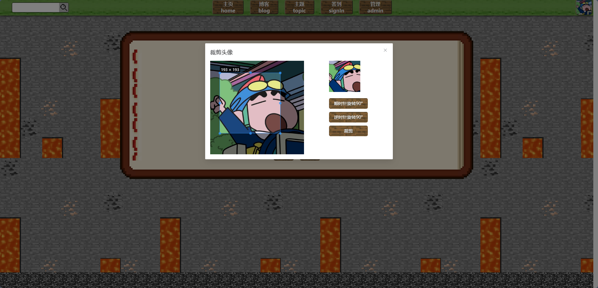

#### Change password

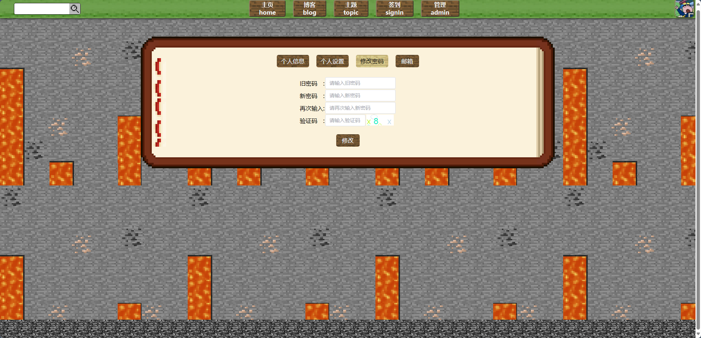

#### Modify email

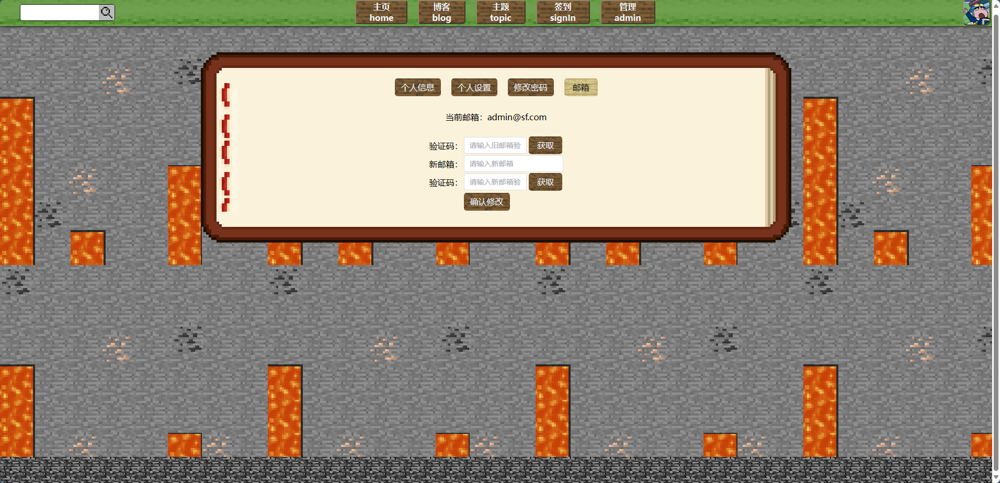

### Others page

When browsing the home page of others, you can see the topics posted by others, but you cannot edit or delete them

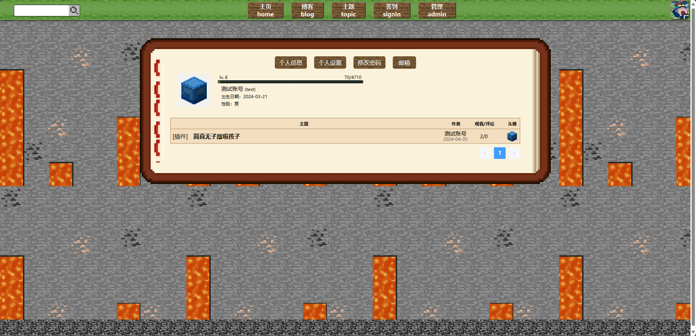

### Sign-in

Check in every day to gain experience, check in for more days in a row, get more rewards, and see where you rank in the check-in leaderboard

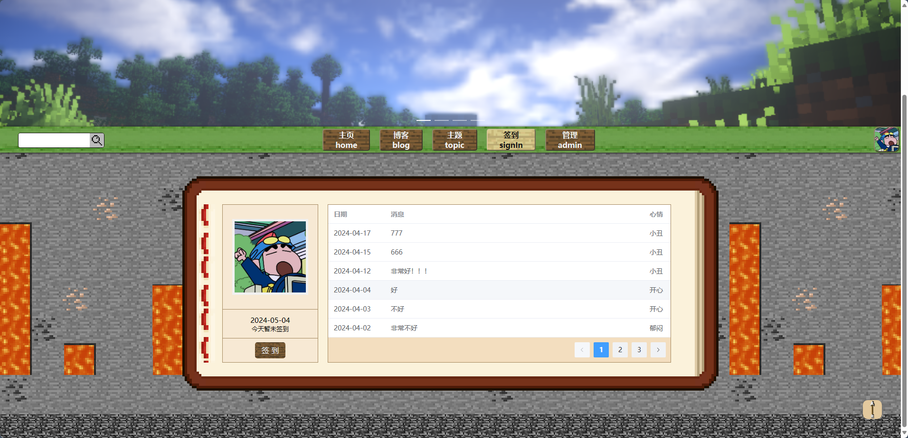

Provide a variety of moods, so that you can record your mood and what you want to say every day

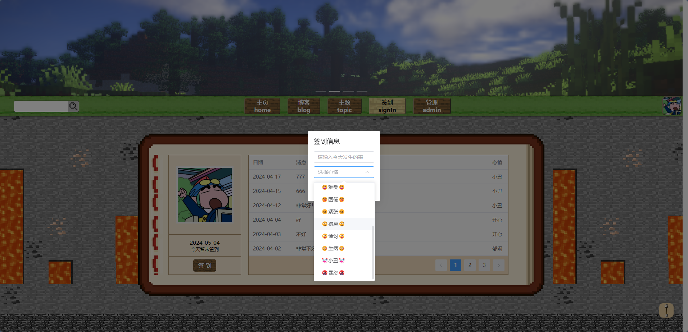

### Navigation bar avatar

把鼠标移到导航栏的头像处，可以看到三个选项，设置、消息和退出

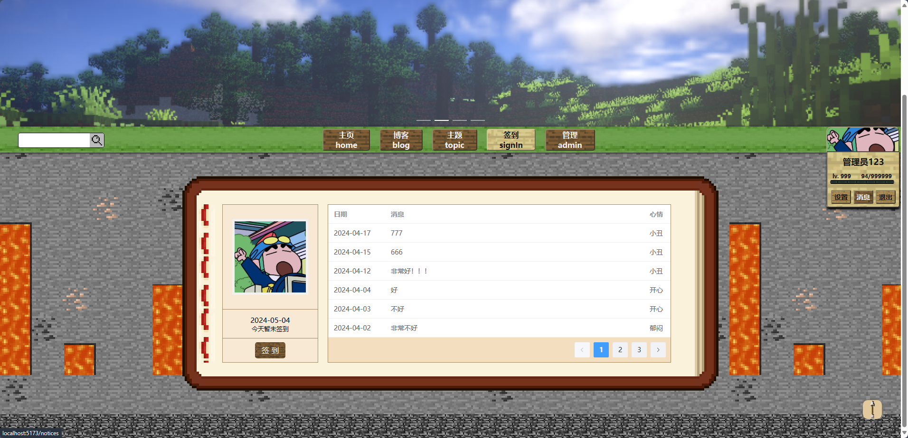

### Communication message

Through **WebSocket**, the forum has a complete chat system, you can chat with each player after adding friends

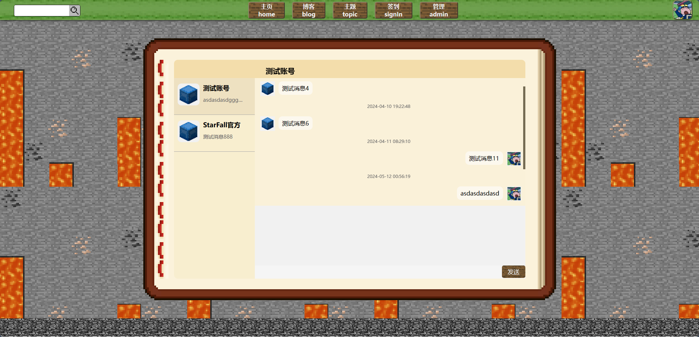

### Search system

Players can search for topics through the search system, which can filter search categories, comprehensive, that is, search all categories

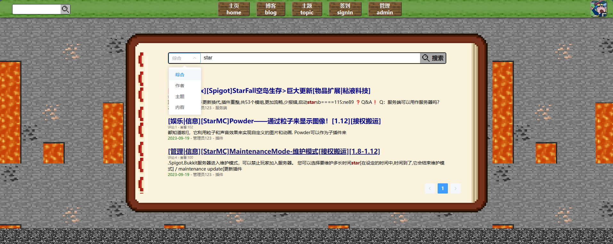

### Management system

The management system can modify the information of each database, including public, theme, comment, user, etc., but also switch the black and white theme, and modify the page is very simple

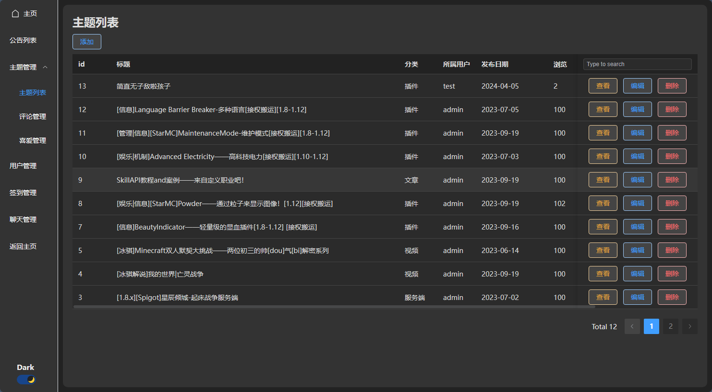

---

---

# Vue3+SpringBoot3搭建以我的世界为主的资源分享论坛

---

> 需要搭配**StarFall-vue**使用：[gitee](https://gitee.com/turing-ice/StarFall-vue)，[github](https://github.com/Turing158/StarFall-vue)

_tips:启动Springboot后记得开启Redis服务，否则会报错！_

## 有话说

---

这个论坛听起来很有趣！这样的资源分享平台对于社区建设和传播我的世界这款游戏，让更多人知道这个方块的世界有无限的可能。本项目开源，由Vue3+**SpringBoot3**创建的一款，可以与各玩家分享交流聊天的游戏论坛，Vue3的响应性和性能优势，再加上Spring Boot的稳定性和强大的后端支持，会为用户提供流畅的体验和可靠的服务。在论坛中，从新手教程到艺术创作，从红石技巧到模组研究，都有可能成为讨论的话题，让各位玩家可以分享自己的见解和经验，从中获得启发和帮助。

## 项目组成

---

### 前端

---

通过Vue3+**ElementPlus**创建的前端页面，页面由用户操作、管理面板，登录注册等页面组成，通过**pinia**来进行本地持续化存储，用户操作的大部分页面组成由自己编写的组件拼接而成，少量通过**ElementPlus**来操作；管理面板全部由**ElementPlus**组成，可更换黑白主题，可视化编辑数据库信息，方便管理员方便管理论坛的一举一动。

### 后端

---

通过**SpringBoot**+**SpringSecurity**+**Mybatis**+**Redis**+**JJWT**组成， 提供了快速启动项目的能力，自动配置和约定优于配置的原则可以减少开发人员的工作量，也给后端提供了一种安全可靠的方式来保护你的应用程序。将这些结合在一起可以提升项目的安全性、开发效率和性能表现，为项目的成功实施提供了良好的基础。

#### SpringBoot

整个项目由**SpringBoot**框架搭建，提供了快速启动项目的能力，通过自动配置和约定优于配置的原则，以及resources\application.properties的一点点配置，可以方便修改当前环境的变更，开发人员可以快速搭建起一个可运行的 Spring 应用程序；通过**SpringBoot**框架的支持，也使得编写代码更加的简便快捷；**SpringBoot**集成了大量常用的框架和库，可以快速集成这些组件，减少了开发人员的工作量；**SpringBoot** 设计之初就考虑了面向生产环境的需求，提供了丰富的生产级别特性，如安全性、性能优化、容错机制等，保证了应用程序在生产环境中的稳定性和可靠性。

#### SpringSecurity

作为Spring全家桶的一员，能够完美的适配**SpringBoot**项目，提供了完善的会话管理功能，可以实现单点登录、会话超时控制、并发控制等，可以对项目进行安全管理；**SpringSecurity**在设计时就考虑到了性能问题，通过各种优化手段，如缓存、异步处理等，确保了安全机制的高效运行；项目通过**SpringSecurity**进行了API的安全管理和权限验证，能够使得API即是访问，也不会无故透露数据库信息，对数据安全做了保证。

#### Mybatis

**Mybatis** 提供了一种更简单的方式来访问数据库，减少了编写 JDBC 代码的工作量。开发人员只需编写 SQL 语句和映射规则，就可以自动实现数据库操作；**SpringBoot**对 **Mybatis** 的良好支持，，只需简单的配置即可快速集成 **Mybatis**，大大提高了开发效率，通过**SpringBoot**结合 **Mybatis**，可以简化持久层的开发，提供了方便的数据库操作接口，可以让后端访问数据库更加的速度和便捷；**Mybatis** 支持动态 SQL，可以根据条件动态生成 SQL 语句，大大提高了 SQL 语句的复用性和可维护性；而且内置了一级缓存和二级缓存机制，可以有效地减少数据库查询次数，提高应用程序的性能。

#### Redis

**Redis** 是基于内存的数据库，读写速度非常快，适合用作高性能的缓存系统，后端通过**SpringBoot**适配**Redis**来进行用户和需要频繁使用的数据进行缓存，进而加快API的访问速度，让前端能更快的收到后端的响应，并缓解后端与数据库访问的压力；支持多种持久化方式，包括快照和日志追加，可以保证数据的持久化存储，防止数据丢失；Spring Boot 项目中可以使用 **Redis** 来管理会话状态，实现分布式会话共享，提高系统的可伸缩性和可靠性；**SpringBoot** 提供了对 **Redis** 的良好支持，可以通过简单的配置即可快速集成 **Redis**，大大提高了开发效率。

#### JJWT

**JJWT** 提供了一个简单易用的 API,开发人员可以快速上手,轻松实现 JWT 的生成、签名、验证和解析等操作；集成Spring Security ，简化了基于 JWT 的认证和授权实现；通过 **JJWT** 来给用户的信息转换成token，让用户有临时唯一的标识，可以设置token的过期时间，来进行防止用户在别的地方因为临时登录被数据泄露，通过**SpringSecurity**的RememberMe和token搭配，可以使用户不需要重复的登录，实现无感刷新token

## 功能

---

### 主页

布局为上中下，上为轮播图和公告，中为导航栏，下为内容展示

### 登录\注册\忘记密码

涉及到隐私数据的操作都需要输入动态图片验证码，以防暴力破解用户信息

### 主题

主题页面是未登录用户也可以访问的，为了让用户先浏览过之后，对资源感兴趣会去注册登录

点击主题的标题即可跳转至详细页面

### 主题详细页面

点击右边栏的头像即可跳转用户详细页面，大标题下面登录后可进行赞和踩

### 主题评论

用户登录后可对主题进行评论

### 登录之后页面

导航栏多出签到选项，如果为管理员，会再多出现管理选项

### 个人主页

可以看到自己的个人信息，以及发表的主题，已发表的主题可进行编辑和删除

### 个人设置

#### 修改个人信息

可对自己的个人信息进行修改，包括头像

#### 修改头像

头像的更改通过VueCropper的支持，可对头像进行剪裁后上传

#### 修改密码

#### 修改邮箱

### 他人主页

在浏览他人的主页时，可以看到他人发表的主题，但不可进行编辑和删除

### 签到

每天签到可获得经验，连续签到多天，可获得更多的奖励，可在签到排行榜看到自己在哪个排名

提供多种心情，让记录自己每一天的心情和想说的话

### 导航栏头像

把鼠标移到导航栏的头像处，可以看到三个选项，设置、消息和退出

### 通讯消息

通过**WebSocket**，论坛有着完善的聊天系统，可以与各玩家添加好友后进行聊天

### 搜索系统

玩家可通过搜索系统来进行对主题的搜索，可筛选搜索分类，综合，即搜所有分类

### 管理系统

管理系统可对各数据库的信息都进行修改，包括公共、主题、评论、用户等，还可切换黑白主题，修改页面非常的简洁

